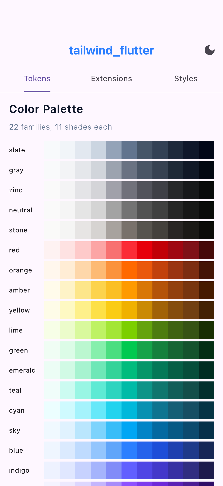
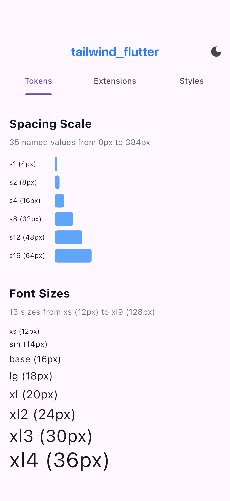
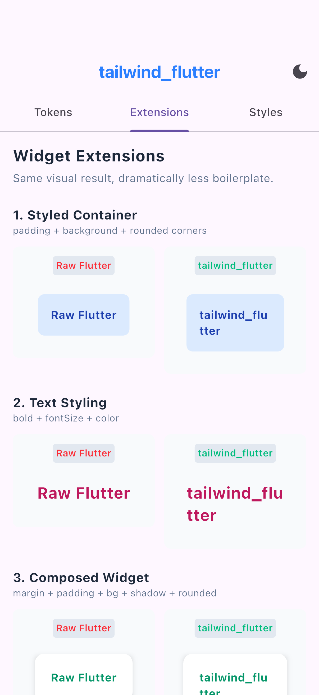
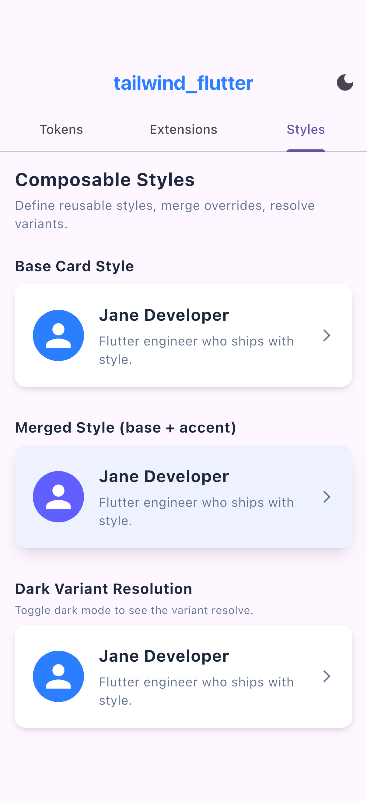

# tailwind_flutter

[](https://pub.dev/packages/tailwind_flutter)
[](https://github.com/user/tailwind_flutter/actions/workflows/ci.yml)
[](LICENSE)
[](https://pub.dev/packages/very_good_analysis)

**Stop nesting six widgets to style a card.**

Styling in Flutter means wrapping your widget in `Padding`, then `ColoredBox`,
then `ClipRRect`, then `DecoratedBox`, then another `Padding` for margin...
you get the idea. tailwind_flutter replaces that nesting pyramid with chainable
extensions that produce the **exact same widget tree** -- flatter code, identical
performance, zero dependencies beyond the Flutter SDK.

```dart
// Before -- six levels of nesting for one styled card:
Padding(
  padding: EdgeInsets.all(12),
  child: DecoratedBox(
    decoration: BoxDecoration(boxShadow: [/* ... */]),
    child: ClipRRect(
      borderRadius: BorderRadius.circular(8),
      child: ColoredBox(
        color: Colors.blue.shade50,
        child: Padding(
          padding: EdgeInsets.all(16),
          child: Text('Hello'),
        ),
      ),
    ),
  ),
)

// After -- same widget tree, readable in one glance:
Text('Hello')
    .p(TwSpacing.s4)
    .bg(TwColors.blue.shade50)
    .rounded(TwRadii.lg)
    .shadow(TwShadows.md)
    .m(TwSpacing.s3)
```

## Features

- **Widget extensions** -- chain `.p()`, `.bg()`, `.rounded()`, `.shadow()`,
  `.border()`, `.gradient()`, `.visible()`, `.aspectRatio()`, `.flexible()`,
  `.expanded()`, `.tooltip()`, and more on any widget instead of nesting
  wrappers manually
- **Text extensions** -- `.bold()`, `.fontSize()`, `.textColor()`,
  `.underline()`, `.lineThrough()`, `.uppercase()`, `.lowercase()`,
  `.capitalize()`, `.fontFamily()`, `.align()` directly on Text widgets
- **Complete design token set** -- 242 colors, 35 spacing values, 13 font sizes,
  9 font weights, 10 border radii, 7 shadow levels, 21 opacity steps, and
  5 responsive breakpoints, all mirroring Tailwind v4's battle-tested scale
- **Composable styles** -- define reusable `TwStyle` objects (like CSS classes),
  merge them, and apply them to widgets
- **Theme integration** -- 7 `ThemeExtension` classes, `TwTheme` widget,
  `context.tw` accessor, light/dark presets
- **Dark mode** -- `TwVariant.dark` / `TwVariant.light` for
  brightness-conditional style overrides
- **Zero dependencies** -- only the Flutter SDK

## Screenshots

<p align="center">
  
  
  
  
</p>

> Example app showing design tokens (colors, spacing, typography), widget extensions with before/after comparisons, and composable styles with variants.

## Quick Start

**1. Add the dependency**

```yaml
dependencies:
  tailwind_flutter: ^0.2.0
```

**2. Wrap your app in TwTheme**

```dart
import 'package:tailwind_flutter/tailwind_flutter.dart';

MaterialApp(
  home: TwTheme(
    data: TwThemeData.light(),
    child: MyHomePage(),
  ),
)
```

**3. Style a widget**

```dart
Text('Hello, Tailwind!')
  .bold()
  .fontSize(TwFontSizes.lg)
  .textColor(TwColors.blue.shade600)
  .p(TwSpacing.s4)
  .bg(TwColors.blue.shade50)
  .rounded(TwRadii.lg)
```

That's it. Three steps, one styled widget.

## API Overview

tailwind_flutter is organized in three tiers, from low-level tokens to
high-level composable styles.

### Tier 1: Design Tokens

Type-safe, `const` values that mirror the Tailwind CSS design system. Every
token is autocomplete-friendly in your IDE.

| Category | Class | Example |
|----------|-------|---------|
| Colors | `TwColors` | `TwColors.blue.shade500` |
| Spacing | `TwSpacing` | `TwSpacing.s4` (16.0) |
| Font sizes | `TwFontSizes` | `TwFontSizes.lg` (18px + paired line-height) |
| Font weights | `TwFontWeights` | `TwFontWeights.semibold` |
| Border radius | `TwRadii` | `TwRadii.lg` (8.0) |
| Shadows | `TwShadows` | `TwShadows.md` |
| Opacity | `TwOpacity` | `TwOpacity.o50` (0.5) |
| Breakpoints | `TwBreakpoints` | `TwBreakpoints.md` (768.0) |

Spacing and radius tokens implement `double`, so they work anywhere Flutter
expects a number. They also provide convenience getters for common types:

```dart
// Spacing as EdgeInsets
Padding(padding: TwSpacing.s4.all)   // EdgeInsets.all(16.0)
Padding(padding: TwSpacing.s4.x)     // EdgeInsets.symmetric(horizontal: 16.0)

// Radius as BorderRadius
BoxDecoration(borderRadius: TwRadii.lg.all)  // BorderRadius.circular(8.0)

// Font size as TextStyle (includes paired line-height)
Text('Hello', style: TwFontSizes.lg.textStyle)
```

### Tier 2: Widget Extensions

Chain methods on any `Widget` (or `Text`) to apply styling without manual
widget nesting. Each method wraps the widget in exactly one Flutter widget.

**Widget extensions** (on any Widget):

| Extension | Description |
|-----------|-------------|
| `.p()`, `.px()`, `.py()`, `.pt()`, `.pb()`, `.pl()`, `.pr()` | Padding (all, horizontal, vertical, directional) |
| `.m()`, `.mx()`, `.my()`, `.mt()`, `.mb()`, `.ml()`, `.mr()` | Margin (all, horizontal, vertical, directional) |
| `.bg(Color)` | Background color |
| `.gradient(Gradient)` | Background gradient |
| `.rounded(double)` | Border radius |
| `.shadow(List<BoxShadow>)` | Box shadow |
| `.border(color:, width:)` | Border on all sides |
| `.borderTop()`, `.borderBottom()`, `.borderLeft()`, `.borderRight()` | Directional borders |
| `.opacity(double)` | Opacity |
| `.width(double)`, `.height(double)` | Size constraints |
| `.visible({required bool visible})` | Visibility toggle |
| `.invisible()` | Hide widget (maintains layout) |
| `.aspectRatio(double)` | Aspect ratio constraint |
| `.flexible(flex:)` | Flexible in a Flex layout |
| `.expanded(flex:)` | Expanded in a Flex layout |
| `.tooltip(String)` | Tooltip wrapper |

```dart
Container(child: Text('Card content'))
  .p(TwSpacing.s4)              // inner padding
  .bg(TwColors.white)           // background color
  .border(color: TwColors.slate.shade200, width: 1)
  .rounded(TwRadii.lg)          // rounded corners
  .shadow(TwShadows.md)         // box shadow
  .opacity(TwOpacity.o90)       // opacity
  .m(TwSpacing.s2)              // outer margin
```

**Text extensions** (on Text widgets):

| Extension | Description |
|-----------|-------------|
| `.bold()` | Bold font weight |
| `.fontSize(double)` | Font size (with paired line-height from tokens) |
| `.fontWeight(FontWeight)` | Arbitrary font weight |
| `.fontFamily(String)` | Font family |
| `.textColor(Color)` | Text color |
| `.letterSpacing(double)` | Letter spacing |
| `.lineHeight(double)` | Line height multiplier |
| `.underline()` | Underline text decoration |
| `.lineThrough()` | Strikethrough decoration |
| `.overline()` | Overline decoration |
| `.uppercase()` | Transform text to UPPERCASE |
| `.lowercase()` | Transform text to lowercase |
| `.capitalize()` | Capitalize First Letter Of Each Word |
| `.align(TextAlign)` | Text alignment |

```dart
Text('Styled text')
  .bold()
  .fontSize(TwFontSizes.xl)
  .textColor(TwColors.slate.shade700)
  .underline()
  .uppercase()
```

> **Order matters:** Text extensions must come before widget extensions in the
> chain, because text extensions return `Text` while widget extensions return
> `Widget`. Once you call a widget extension, text-specific methods are no
> longer available.

### Tier 3: Composable Styles (TwStyle)

Define reusable style objects -- the Flutter equivalent of CSS classes. Merge
them, resolve dark mode variants, and apply them to widgets.

**Define a style:**

```dart
const card = TwStyle(
  padding: EdgeInsets.all(16),
  backgroundColor: Color(0xFFFFFFFF),
  borderRadius: BorderRadius.all(Radius.circular(8)),
  shadows: TwShadows.md,
);
```

**Merge styles** (right-side-wins):

```dart
final highlighted = card.merge(TwStyle(
  backgroundColor: TwColors.blue.shade50,
  shadows: TwShadows.lg,
));
// highlighted keeps card's padding and borderRadius,
// but overrides backgroundColor and shadows
```

**Dark mode variants:**

```dart
final themed = TwStyle(
  backgroundColor: TwColors.white,
  textStyle: TextStyle(color: TwColors.slate.shade900),
  variants: {
    TwVariant.dark: TwStyle(
      backgroundColor: TwColors.zinc.shade900,
      textStyle: TextStyle(color: TwColors.zinc.shade100),
    ),
  },
);

// In your build method -- resolve then apply:
Widget build(BuildContext context) {
  return themed.resolve(context).apply(child: Text('Adaptive card'));
}
```

## Performance

Chained extensions produce the **exact same widget tree** as manually nesting
`Padding`, `ColoredBox`, `ClipRRect`, etc. Each extension method is syntactic
sugar that returns the standard Flutter widget you would write by hand -- no
wrapper widgets, no intermediate builders, no performance layer.

Benchmarks confirm this:

| Approach | Tree depth | Widget types |
|----------|-----------|--------------|
| Chained extensions (`.p().bg().rounded()`) | 6 | Identical |
| Manual nesting (`Padding(child: ColoredBox(...))`) | 6 | Identical |
| `TwStyle.apply()` (consolidates into `DecoratedBox`) | 5 | Fewer elements |

Tree depth and widget type sequences are verified by assertion, not just
observation. For performance-critical hot paths (long scrolling lists, animated
transitions), `TwStyle.apply()` consolidates `backgroundColor`, `borderRadius`,
and `shadows` into a single `DecoratedBox` for fewer `Element.update()` calls
per frame.

Full methodology and results: [docs/performance.md](docs/performance.md)

## Comparison with VelocityX

[VelocityX](https://pub.dev/packages/velocity_x) is the most well-known
Tailwind-inspired Flutter package, and it's been around much longer -- it has
a larger community and a broader scope. Here's how the two differ:

| Dimension | VelocityX | tailwind_flutter |
|---|---|---|
| **Scope** | Full framework (widgets, state mgmt, utils) | Focused (tokens + styling only) |
| **Dependencies** | 5 external | 0 (Flutter SDK only) |
| **Runtime cost** | Builder objects allocated per styled widget | Zero (extension types compile away) |
| **Token fidelity** | Tailwind-inspired names, custom pixel scales | Tailwind v4 exact rem-based scales |
| **Style composition** | No reusable style system | TwStyle with merge/resolve/dark mode |
| **Theme integration** | None (bypasses ThemeData) | Native ThemeData.extensions |
| **Builder pattern** | Yes (`.text.bold.make()`) | No (direct widget extensions) |
| **Maintenance** | Maintenance mode since 2023, docs site offline | Active development |

**Where VelocityX wins:** If you want an all-in-one framework with navigation
helpers, responsive builders, state management utils, and a large existing
community, VelocityX covers more ground.

**Where tailwind_flutter wins:** If you want a focused styling library that
composes with standard Flutter instead of replacing it -- zero dependencies,
compile-time extensions (no builder allocations), exact Tailwind v4 token
fidelity, reusable `TwStyle` objects, and native `ThemeData` integration.

The key philosophical difference: VelocityX is a **framework** that wants to
own your widget tree. tailwind_flutter is a **library** that composes with
standard Flutter widgets and patterns.

## Tailwind CSS Mapping

Coming from Tailwind CSS on the web? Here's how utilities map to
tailwind_flutter:

| Tailwind CSS | tailwind_flutter | Notes |
|---|---|---|
| `bg-blue-500` | `.bg(TwColors.blue.shade500)` | Widget extension |
| `p-4` | `.p(TwSpacing.s4)` | 16px padding all sides |
| `px-6` | `.px(TwSpacing.s6)` | Horizontal padding |
| `py-2` | `.py(TwSpacing.s2)` | Vertical padding |
| `m-4` | `.m(TwSpacing.s4)` | Outer margin |
| `rounded-lg` | `.rounded(TwRadii.lg)` | 8px border radius |
| `text-lg` | `.fontSize(TwFontSizes.lg)` | 18px font size + paired line-height |
| `font-bold` | `.bold()` | Text extension |
| `font-semibold` | `.fontWeight(TwFontWeights.semibold)` | Text extension |
| `shadow-md` | `.shadow(TwShadows.md)` | Widget extension |
| `opacity-50` | `.opacity(TwOpacity.o50)` | Widget extension |
| `text-slate-700` | `.textColor(TwColors.slate.shade700)` | Text extension |
| `w-64` | `.width(TwSpacing.s64)` | 256px width |
| `border` | `.border(color:, width:)` | Widget extension |
| `border-t` | `.borderTop()` | Directional border |
| `underline` | `.underline()` | Text extension |
| `uppercase` | `.uppercase()` | Text extension |
| `invisible` | `.invisible()` | Widget extension |
| `dark:bg-gray-800` | `TwVariant.dark` in TwStyle variants | Resolve with context |

## Theme Setup

### Basic setup

Wrap your app (or a subtree) in `TwTheme` to make all tokens available via
Flutter's theme system:

```dart
MaterialApp(
  home: TwTheme(
    data: TwThemeData.light(),
    child: MyHomePage(),
  ),
)
```

### Dark mode

Switch to the dark preset:

```dart
TwTheme(
  data: TwThemeData.dark(),
  child: MyApp(),
)
```

### Custom overrides

Override specific token categories while keeping defaults for the rest:

```dart
TwTheme(
  data: TwThemeData.light(
    colors: myBrandColors,
  ),
  child: MyApp(),
)
```

### Accessing tokens from context

Use `context.tw` in any build method to access theme-aware tokens:

```dart
Widget build(BuildContext context) {
  final primary = context.tw.colors.blue.shade500;
  final space = context.tw.spacing.s4;

  return Container(
    padding: EdgeInsets.all(space),
    color: primary,
    child: Text('Themed widget'),
  );
}
```

## Contributing

Contributions are welcome.

- **Bugs and feature requests:** [open an issue](https://github.com/user/tailwind_flutter/issues)
- **Code contributions:** fork the repo, create a branch, and submit a PR
- **Lint rules:** this project uses [very_good_analysis](https://pub.dev/packages/very_good_analysis) --
  run `dart format .` and `flutter analyze` before submitting

## License

MIT License. See [LICENSE](LICENSE) for details.
